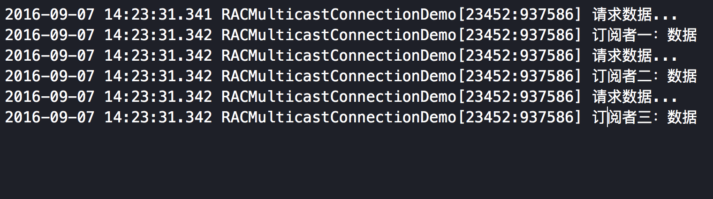

#### RAC之RACMulticastConnection，用于当一个信号，被多次订阅时，为了保证创建信号时，避免多次调用创建信号中的block，造成副作用，可以使用这个类处理。

#####未使用前:
```
    RACSignal *signal = [RACSignal createSignal:^RACDisposable *(id<RACSubscriber> subscriber) {
        NSLog(@"请求数据...");
        [subscriber sendNext:@"数据"];
        return nil;
    }];
    
    [signal subscribeNext:^(id x) {
        NSLog(@"订阅者一：%@",x);
    }];
    
    [signal subscribeNext:^(id x) {
        NSLog(@"订阅者二：%@",x);
    }];
    
    [signal subscribeNext:^(id x) {
        NSLog(@"订阅者三：%@",x);
    }];


```
#####结果:


#####RACMulticastConnection解决:
```
    RACSignal *signal = [RACSignal createSignal:^RACDisposable *(id<RACSubscriber> subscriber) {
        NSLog(@"请求数据...");
        [subscriber sendNext:@"数据"];
        return nil;
    }];
    
    RACMulticastConnection *connection = [signal publish];
    
    [connection.signal subscribeNext:^(id x) {
        NSLog(@"订阅者一：%@",x);
    }];
    
    [connection.signal subscribeNext:^(id x) {
        NSLog(@"订阅者二：%@",x);
    }];
    
    [connection.signal subscribeNext:^(id x) {
        NSLog(@"订阅者三：%@",x);
    }];
    
    [connection connect];

```
#####结果:

